# Setup APEX Application & Configure SSO/IDCS

## Introduction

In this lab, you learn to install and run Oracle APEX Application for RFP Management System.

This lab also covers updating the APEX Rest Datasource urls & credentials for connecting to WebCenter Content Instance

**Estimated Lab Time**: *20 minutes*

### Objectives

In this lab, you will:

- Navigate through Oracle APEX
- Create New Workspace
- Login to Workspace and Install Packaged Application.
- Update Rest Data sources URL and credentials

### Prerequisites

This lab assumes you have:

- A  Paid or LiveLabs Oracle Cloud account
- You have completed:
  - Lab: Prepare Setup ( *Paid Tenants* only)
  - Lab: Setup WCC Marketplace Environment
  - Lab: Initialize Environment

## Task 1: Create New APEX Workspace for RFP Management Application

To create new APEX workspace, you need log in to Oracle APEX's default **INTERNAL** Workspaces as **ADMIN** User (or) the user with Administrator Privilege on the APEX Instance

1. On the new *web browser* window , Login to the APEX/ORDS URL as **ADMIN** User of System's **INTERNAL** Workspace. Details are provided below
    - **URL**
          ```
          <copy>https://localhost:16200/ords/</copy>
          ```

         > Note : Replace `"https://localhost"` with your **hosturl** ( eg: `"https://wcc-rfpmgmt-livelab.livelabs.oraclevcn.com"` or `"https://192.0.0.0""`)
    - **Workspace Name**
          ```
          <copy>INTERNAL</copy>
          ```
    - **Username**
          ```
          <copy>ADMIN</copy>
          ```
    - **Password**
          ```
          <copy>WelCwcm123##</copy>
          ```
    > **For ATP DB** *, ADMIN password is same as the ADMIN DB schema user password*.
    > *If any issues with ADMIN credentials, Refer to **Appendix 5: Reset ADMIN password for APEX/ORDS** of the previous lab **Initialize WCC Environment** to reset ADMIN Password*
  

2. In the *Administration Services* Landing page , Click on **Create Workspace** button on the top right corner
  

3. Provide the value for **Workspace Name**  and click **Next** Button
        ```
        <copy>WCCRFPMGMT</copy>
        ```
  

4. Provide the values for DB Schema details as mentioned below and click **Next** Button
    - **Re-use existing schema?**: Select **No**
    - **Schema Name**: Enter
          ```
          <copy>WCCRFPMGMT_SCHEMA</copy>
          ```
    - **Schema Password**: Enter
          ```
          <copy>WelCwcm123##</copy>
          ```
    - **Space Quota (MB)**: Select **500**
  

5. Provide the values for Workspace **ADMIN** User details as mentioned below and click **Next** Button

    - **Administrator Username**: Enter
          ```
          <copy>ADMIN</copy>
          ```
    - **Administrator Password**: Enter
          ```
          <copy>WelCwcm123##</copy>
          ```
    - **First Name**: Enter
          ```
          <copy>Admin</copy>
          ```
    - **Last Name**: Enter
          ```
          <copy>User</copy>
          ```
    - **Email**: Enter your email id
          ```
          <copy>admin_user@email.com</copy>
          ```
  

6. Review the details and click **Create Workspace** Button
 

7. After the workspace is successfully created, it will display  workspace details.  click **Done** Button

 

## Task 2: Login to Newly Created APEX Workspace

To log in to Oracle APEX, you need a Workspace Name, username, and the password created for that Workspace. In this hands-on lab, you log in to your Oracle APEX Workspace.

1. To login to your Oracle APEX Workspace, perform the following steps:
    - Open your browser and enter the **URL** to sign in to the APEX development environment.
      - **URL**
            ```
            <copy>https://localhost:16200/ords/</copy>
            ```

            > Note : Replace `"https://localhost:16200"` with your **hosturl** ( eg: `"https://wcc-rfpmgmt-livelab.livelabs.oraclevcn.com:16200"` or `"https://192.0.0.0:16200"`)

    - The login page appears. Enter the **Workspace Name, Username, and Password**. Click **Sign In**.
      - **Workspace Name**: Enter
            ```
            <copy>WCCRFPMGMT</copy>
            ```
      - **Username**: Enter
            ```
            <copy>ADMIN</copy>
            ```
      - **Password**: Enter
            ```
            <copy>WelCwcm123##</copy>
            ```
  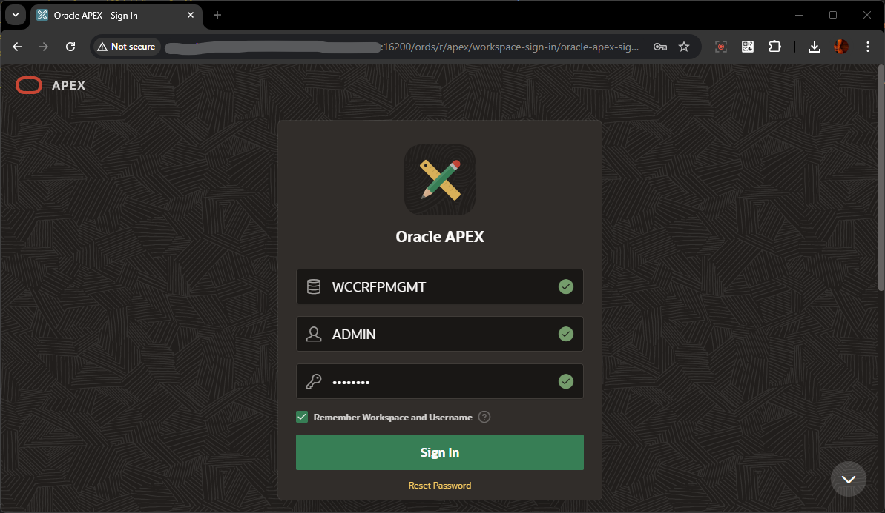

2. If its first time Login, Change password for the ADMIN user. You can provide the same Password value and click on **Change Password**.
    > Skip this step if it does not prompt for Change Password

    - **New Password**: Enter
          ```
          <copy>WelCwcm123##</copy>
          ```
    - **Confirm Password**: Enter
          ```
          <copy>WelCwcm123##</copy>
          ```
  

3. The Workspace home page appears.

  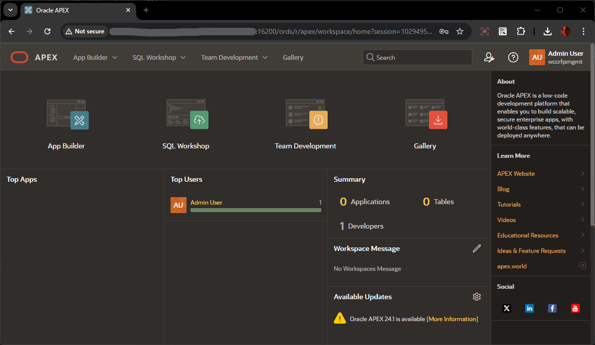

## Task 3: Install RFP Management Application

This task covers installing and running a WCC RFP Management System APEX application.

1. Edit the downloaded APEX Application sql file **wcc-rfp-mgmt-system-apex-app-idcs.sql** in a text editor (eg: Notepad) , replace `"https://localhost:16200"` with your **hosturl** ( eg: `"https://wcc-rfpmgmt-livelab.livelabs.oraclevcn.com:16200"` or `"https://192.0.0.0:16200"`)  and save the file.

      > Note: *In the scenario, where WebCenter Content is configured with IDCS*, replace these two values also:
      - Replace **"weblogic"** with *WebCenter Content Username* which has *Administrator Privileges* on WebCenter Content **&**
      - Replace **"Welcome1"** with the *Password for the above user*

      

2. After Login to the WORKSPACE **WCCRFPMGMT** as ADMIN user, in the Home Page, Under  **App Builder** , click on **Import**
  

3. Select the updated file **wcc-rfp-mgmt-system-apex-app.sql**  , ensure that the **File Type** is selected as **Application, Page or Component** and click **Next** Button
  

4. In the **Install Application** Page, Verify the below values and click **Install Application** Button

    - *Current Workspace* : **WCCRFPMGMT**
    - *Parsing Schema* : **WCCRFPMGMT_SCHEMA**
    - *Build Status* : **Run and Build Application**
    - *Install as Application* : **Reuse Application ID 999 From Imported Application**
  

5. In the **Install Application** - **Credentials** Page, for **Credentials for WCC RFP Mgmt**, Update the values for the below *( Update it with the WebCenter Content User Credentials which has Administrator Privileges on WebCenter Content )* and click **Next** Button
    - **Client ID or Username** : Enter
          ```
          <copy>wccadmin</copy>
          ```
    - **Client Secret or Password** : Enter
          ```
          <copy>Welcome1</copy>
          ```
    - **Verify Client Secret / Password** : Enter
          ```
          <copy>Welcome1</copy>
          ```
      > Note: In the scenario, where WebCenter Content is configured with IDCS, update these values accordingly with user having **Administrator Privileges** in WebCenter Content

    - In the **Remote Servers** section, Verify & update the **Base URL** hostname if required
  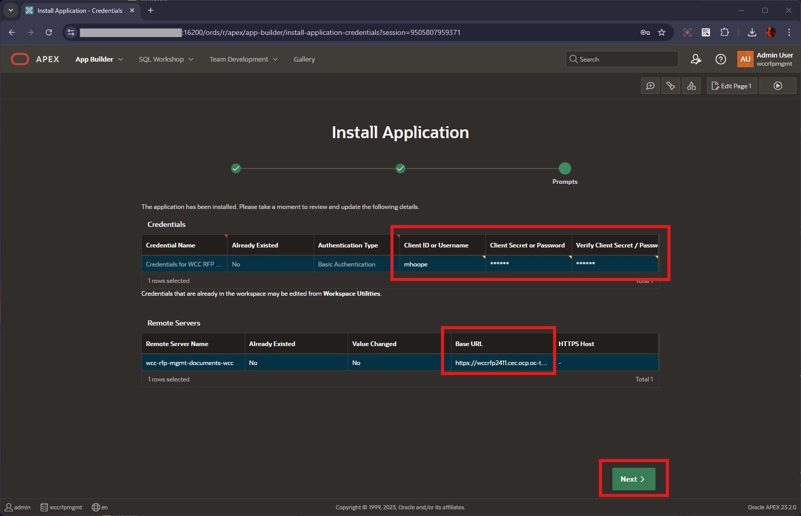

6. After the Credentials is updated, in the **Application Installed** Page, click on **Install Supporting Objects** button
  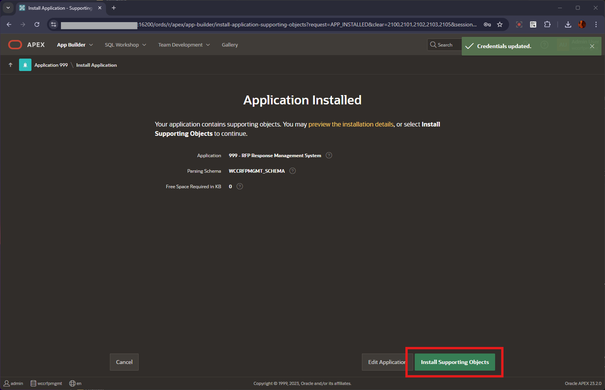

7. After the Supporting Objects installed, click on **Install Summary** button , to view the status of the Supporting objects installation
  

## Task 4: Import REST DataSource Catalog

This task covers importing and configuring Rest Datasource Catalog.

1. Edit the downloaded APEX Application sql file **WCC\_RFP\_Rest\_Catalog.sql** in a text editor (eg: Notepad) , replace `"https://localhost:16200"` with your **hosturl** ( eg: `"https://wcc-rfpmgmt-livelab.livelabs.oraclevcn.com:16200"` or `"https://192.0.0.0:16200"`) and save the file.
  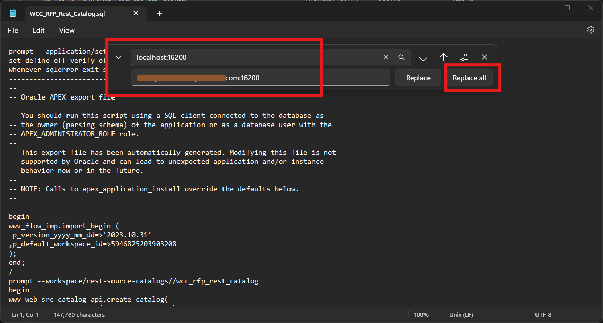

2. In the Home Page, Under  **Apex Builder** , click on **Import**
  

3. Select the updated file **WCC_RFP_Rest_Catalog.sql** , ensure that the **File Type** is selected as **REST Source Catalog** and click **Next** Button
  

4. Click **Next** in the **Import** Page
  

5. In the **Rest Catalog Import** Page, Enter the value for **Catalog Group** and click on **Import REST Catalog** Button
    - **Catalog Group** : Enter
            ```
            <copy>WCC_RFP_REST_CATALOG_GROUP</copy>
            ```
  

6. After the REST Catalog is imported, click on **1Services** under the **Contents** tab for the imported **WCC RFP Rest Catalog**
  

7. In the **Catalog Services** list, click on the *Name* **quick\_search\_library**
  

8. In the **Service Details** Section, Verify the **Base URL** with *hosturl*  and click **Apply Changes** Button if required
  

## Task 5 : Refresh REST Datasource Catalog

1. To login to your Oracle APEX Workspace, perform the following steps:
    - Open your browser and enter the **URL** to sign in to the APEX development environment.
      - **URL**
            ```
            <copy>https://localhost:16200/ords/</copy>
            ```

            > Note : Replace `"https://localhost"` with your **hosturl** ( eg: `"http://wcc-rfpmgmt-livelab.livelabs.oraclevcn.com"` or `"https://192.0.0.0"`)

    - The login page appears. Enter the **Workspace Name, Username, and Password**. Click **Sign In**.
      - **Workspace Name**: Enter
            ```
            <copy>WCCRFPMGMT</copy>
            ```
      - **Username**: Enter
            ```
            <copy>ADMIN</copy>
            ```
      - **Password**: Enter
            ```
            <copy>WelCwcm123##</copy>
            ```
  

2. Click on **App Builder** , then click on **RFP Response Management System** Application
  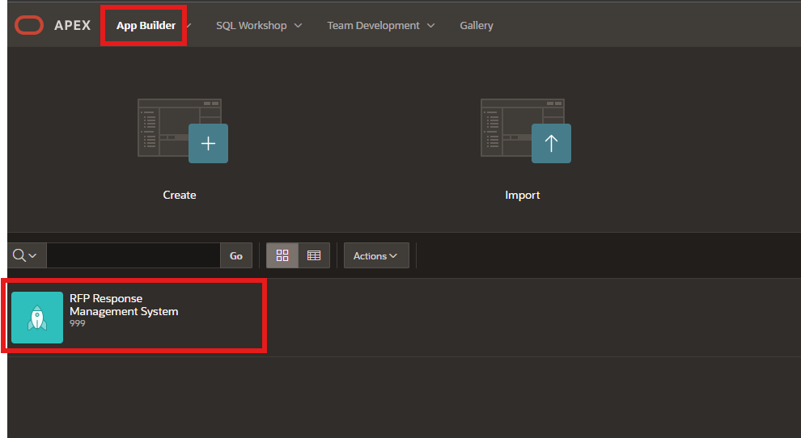

3. Navigate to **Shared Components** > Under **Data Sources**, click on **REST Data Sources**
  

4. Click on **quick\_search\_library** under the **REST Source Name** list
  

5. Click on the **REST Source Catalog** tab and then click on **Refresh from Catalog** button
  

6. Click on the **Refresh from Service Catalog** button
  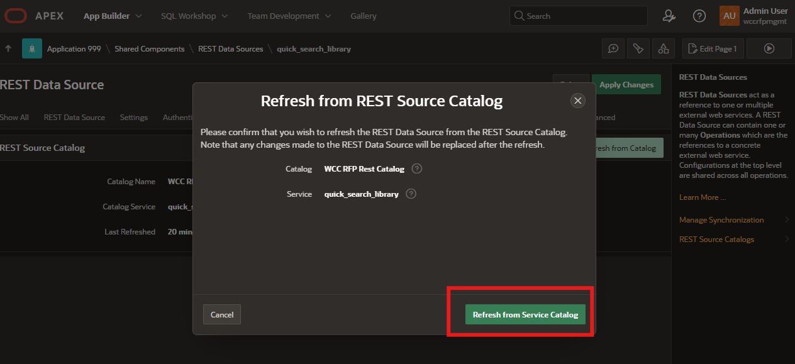

## Task 6 : Validate REST Datasource

1. To login to your Oracle APEX Workspace, perform the following steps:
    - Open your browser and enter the **URL** to sign in to the APEX development environment.
      - **URL**
            ```
            <copy>https://localhost:16200/ords/</copy>
            ```

            > Note : Replace `"https://localhost"` with your **hosturl** ( eg: `"http://wcc-rfpmgmt-livelab.livelabs.oraclevcn.com"` or `"https://192.0.0.0"`)

    - The login page appears. Enter the **Workspace Name, Username, and Password**. Click **Sign In**.
      - **Workspace Name**: Enter
            ```
            <copy>WCCRFPMGMT</copy>
            ```
      - **Username**: Enter
            ```
            <copy>ADMIN</copy>
            ```
      - **Password**: Enter
            ```
            <copy>WelCwcm123##</copy>
            ```
  

2. Click on **App Builder** , then click on **RFP Response Management System** Application
  

3. Navigate to **Shared Components** > Under **Data Sources**, click on **REST Data Sources**
  

4. Click on **quick\_search\_library** under the **REST Source Name** list
  

5. Click on the **Operations** tab and then click on the play icon under **Test Operation** column
  

    > *Note: If you encounter _**Certificate validation failure**_ , please follow the steps mentioned under **Appendix 1: Configure Wallet for https connectivity** and then try **Test Operation** step again*
      

**Summary**
        You have now successfully Installed the RFP Response Management Application for the RFP Application.

You are now ready to **proceed to the next lab**.

## Appendix 1: Configure Wallet for https connectivity

   These steps are to be performed only if the secured http protocol is used by the WebCenter Content ( *ie URL has **https*** )
   > **Note:** ***If the DB System was created with multi-nodes, the Steps 1.2 and 1.3 needs to be performed on all the DB Nodes created in the DB System***

- This consists of the below steps:
      - **Download certificate**
      - **Connect to DB System via SSH and create wallet**
      - **Configure APEX to use wallet directory**

### **1.1 Download Certificate**

   1. Open your browser and enter the **URL** to sign in to the APEX development environment.
      - URL
            ```
            <copy>https://localhost:16200/ords/</copy>
            ```

      > Note : Replace `"https://localhost"` with your **hosturl** ( eg: `"http://wcc-rfpmgmt-livelab.livelabs.oraclevcn.com"` or `"https://192.0.0.0"`)

   2. In the browser header section, before the url, click on the **Not Secure** icon. Then click on **Certificate is not valid** to **Show certificate** details
      > **Note** : *If the url is configured with valid certificate , it'll show a **Secure Lock** icon and will list as **Certificate is valid***
      

   3. In the **Certificate Viewer** window, in the **Details** tab, click on the top root entry under the **Certificate Hierarchy** and click **Export** button
      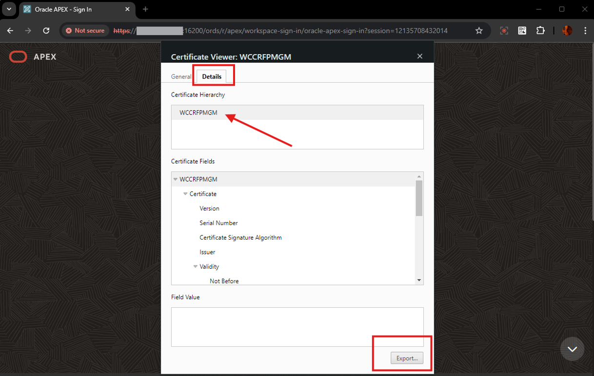

    > **Note** : If there is more than one level of hierarchy, select the top most root entry
      

   4. Save the file as the below filename
      - **Filename**
            ```
            <copy>WCCRFPMGM.crt</copy>
            ```

      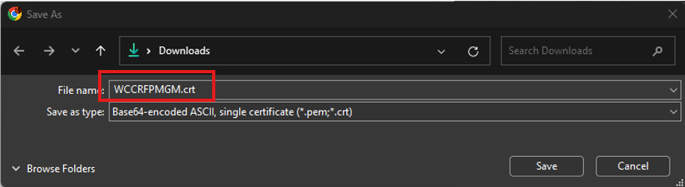

### **1.2 Connect to DB System via SSH and create wallet**

   1. Log in to **OCI Console**, navigate to **Oracle Database**, then to **Oracle Base Database Service** and Click on the DB System **wcc-rfpmgmt-DBSystem** ( *which was created as part of the Lab **Prepare Setup*** )
      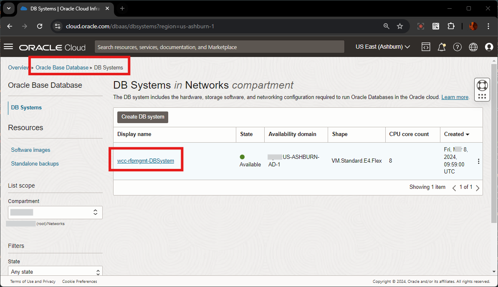

   2. Scroll down to the **Resources** Section and click on **Nodes**. Note the *IP Address* of all the Nodes listed
      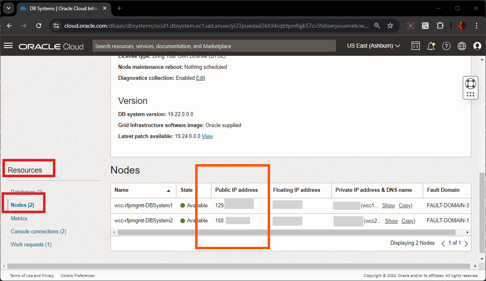

   3. Open a terminal or a bash window , and invoke the below ssh command to login to the Node as **opc** user and then switch to **oracle** user
      - **ssh command**
            ```
            <copy>ssh -i db-ssh.key opc@xxx.xxx.xxx.xxx
            sudo su - oracle </copy>
            ```

      - **Note** :
        - **db-ssh.key** - is the key used/created while creating the DB System ( in Lab **Prepare Setup** , **Task 3: Create Database**, **3.2 Create a New DB System**). *FYI, Also, if **vault** was used for storing keys and secrets, this key can be obtained from there as well*
        - **xxx.xxx.xxx.xxx** - replace this value with the ip address of the node

      

   4. Open the previously downloaded **WCCRFPMGM.crt** certificate file in Notepad or Text Editor , and copy its contents.
      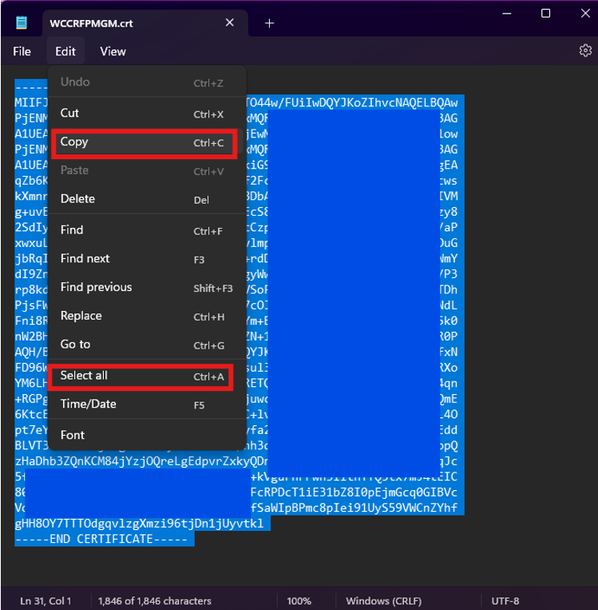

   5. In the terminal window, invoke the below command to create file **/tmp/WCCRFPMGM.crt**, paste the certificate contents and save the crt file
      - **ssh command**
            ```
            <copy>WCCRFPMGM.crt/</copy>
            ```

      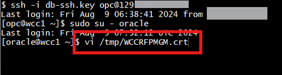

   6. In the terminal window, invoke the below commands to create the wallet directory, create the wallet, and import the certificate as trusted certificate. Note down the **$ORACLE\_HOME/db\_wallet** location ( eg: **/u01/app/oracle/product/19.0.0.0/dbhome_1/db\_wallet**)
      - **ssh commands**
           - *Create wallet directory and create a oracle wallet in that directory ( Note: if this wallet directory and wallet files are already present, then skip this creation command)*
                  ```
                  <copy>
                        mkdir -pm 777 $ORACLE_HOME/db_wallet
                        $ORACLE_HOME/bin/orapki wallet create -wallet $ORACLE_HOME/db_wallet  -pwd WelCwcm123## -auto_login
                  </copy>
                  ```
           - *Invoke the below command to add the certificate to the trusted certificates list of the wallet*
                  ```
                  <copy>
                        $ORACLE_HOME/bin/orapki wallet add -wallet $ORACLE_HOME/db_wallet -trusted_cert -cert "/tmp/WCCRFPMGM.crt" -pwd WelCwcm123##
                  </copy>
                  ```
           - *Invoke these commands to list the certificates present in that wallet and also display the full path of the wallet directory (this directory is used for configuring **Wallet Path** in APEX)*
                  ```
                  <copy>
                        $ORACLE_HOME/bin/orapki wallet display -wallet $ORACLE_HOME/db_wallet  -pwd WelCwcm123##
                        echo
                        echo $ORACLE_HOME/db_wallet
                        ls -ltrh $ORACLE_HOME/db_wallet
                  </copy>
                  ```

      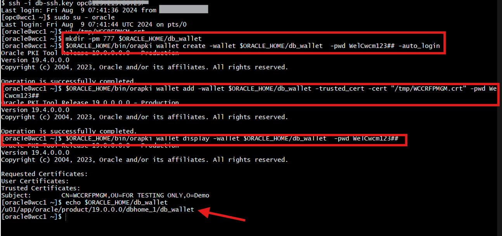

### **1.3 Configure APEX to use wallet directory**

  *To Configure APEX to use wallet directory, you need log in to Oracle APEX's default **INTERNAL** Workspaces as **ADMIN** User (or) the user with Administrator Privilege on the APEX Instance*

   1. On the new *web browser* window , Login to the APEX/ORDS URL as **ADMIN** User of System's **INTERNAL** Workspace. Details are provided below
      - **URL**
            ```
            <copy>https://localhost:16200/ords/</copy>
            ```
        > Note : Replace `"https://localhost"` with your **hosturl** ( eg: `"http://wcc-rfpmgmt-livelab.livelabs.oraclevcn.com"` or `"https://192.0.0.0"`)

      - **Workspace Name**
            ```
            <copy>INTERNAL</copy>
            ```
      - **Username**
            ```
            <copy>ADMIN</copy>
            ```
      - **Password**
            ```
            <copy>WelCwcm123##</copy>
            ```
   2. Navigate to **Manage Instance**, **Instance Settings**, click on **Wallet** tab , provide the below details and click on **Apply Changes** button
      - **Wallet Path**
            ```
            <copy>file:/u01/app/oracle/product/19.0.0.0/dbhome_1/db_wallet</copy>
            ```
      - **Auto-login Wallet** - *Un-Checked*
      - **Password**
            ```
            <copy>WelCwcm123##</copy>
            ```
      - **Confirm Password**
            ```
            <copy>WelCwcm123##</copy>
            ```
      - **Note** : *If you see any issue with the APEX URL, click on the link on error list and select the default url*

      

      - **Note** *: If there is any error shown, please click on the error description, and provide the (Default) value for those fields and click **Apply Changes***

        

   3. Instance Settings changes gets saved successfully.
    


## Acknowledgements

- **Authors-** Senthilkumar Chinnappa, Senior Principal Solution Engineer, Oracle WebCenter Content
- **Contributors-** Senthilkumar Chinnappa, Mandar Tengse , Parikshit Khisty
- **Last Updated By/Date-** Senthilkumar Chinnappa, July 2024
