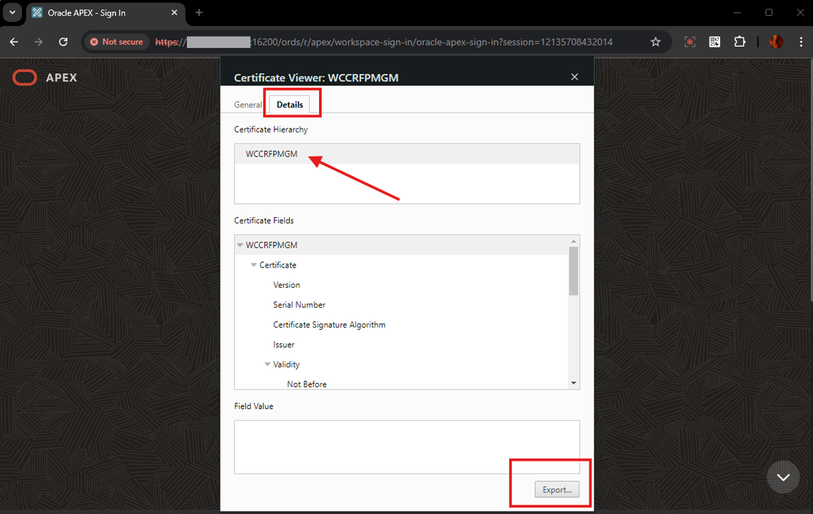
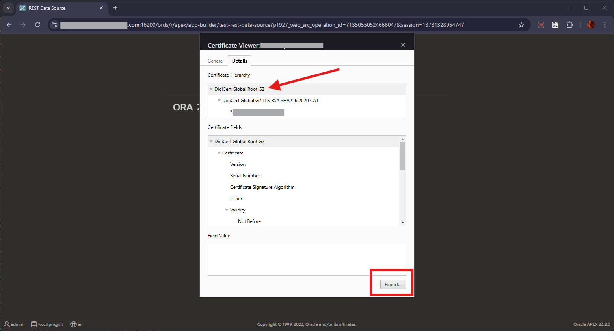
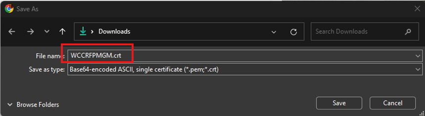
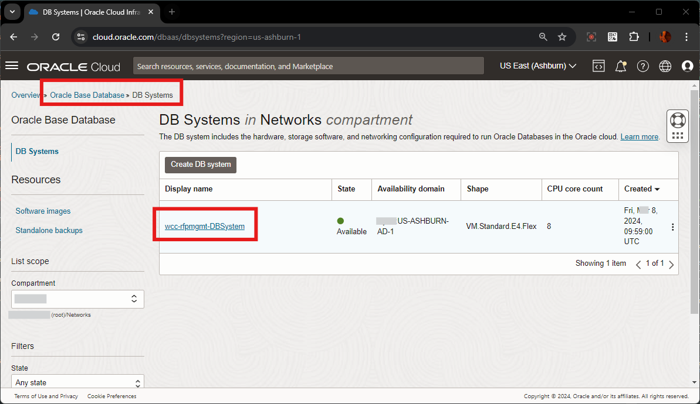
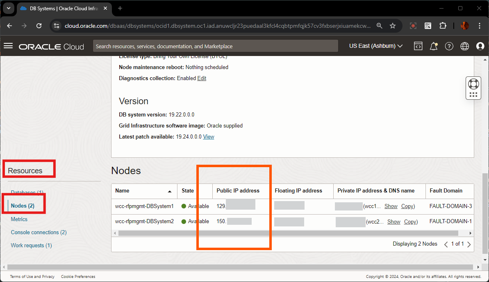
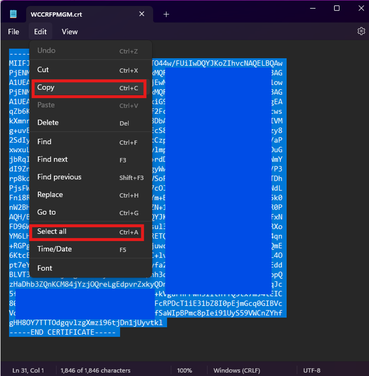
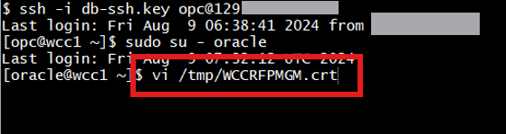
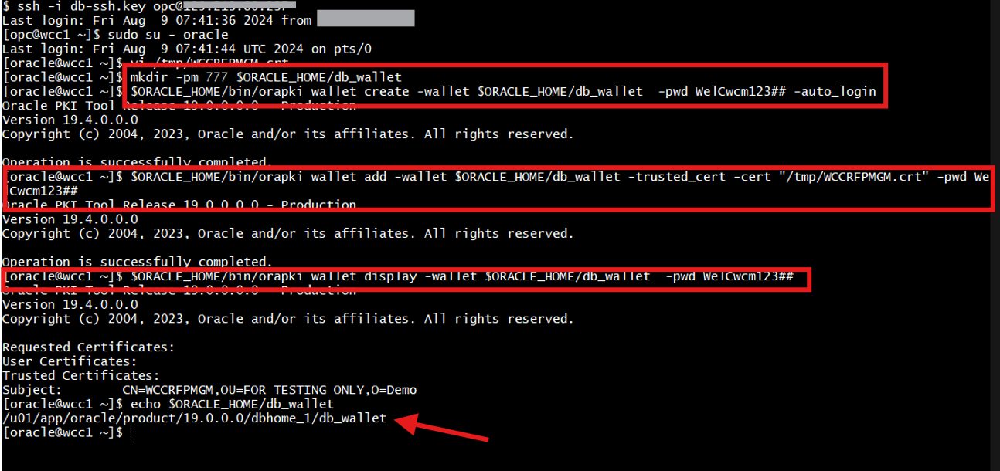

# Configure Wallet for https connectivity

   These steps are to be performed only if the secured http protocol is used by the WebCenter Content ( *ie URL has **https*** )
   > **Note:** ***If the DB System was created with multi-nodes, the Steps 1.2 and 1.3 needs to be performed on all the DB Nodes created in the DB System***

- This consists of the below steps:
      - **Download certificate**
      - **Connect to DB System via SSH and create wallet**
      - **Configure APEX to use wallet directory**

## **1.1 Download Certificate**

   1. Open your browser and enter the **URL** to sign in to the APEX development environment.
      - URL
            ```
            <copy>https://localhost:16200/ords/</copy>
            ```

      > Note : Replace `"https://localhost"` with your **hosturl** ( eg: `"http://wcc-rfpmgmt-livelab.livelabs.oraclevcn.com"` or `"https://192.0.0.0"`)

   2. In the browser header section, before the url, click on the **Not Secure** icon. Then click on **Certificate is not valid** to **Show certificate** details
      > **Note** : *If the url is configured with valid certificate , it'll show a **Secure Lock** icon and will list as **Certificate is valid***
      

   3. In the **Certificate Viewer** window, in the **Details** tab, click on the top root entry under the **Certificate Hierarchy** and click **Export** button
      

    > **Note** : If there is more than one level of hierarchy, select the top most root entry.
      

   4. Save the file as the below filename
      - **Filename**
            ```
            <copy>WCCRFPMGM.crt</copy>
            ```

      

## **1.2 Connect to DB System via SSH and create wallet**

   1. Log in to **OCI Console**, navigate to **Oracle Database**, then to **Oracle Base Database Service** and Click on the DB System **wcc-rfpmgmt-DBSystem** ( *which was created as part of the Lab **Prepare Setup*** )
      

   2. Scroll down to the **Resources** Section and click on **Nodes**. Note the *IP Address* of all the Nodes listed
      

   3. Open a terminal or a bash window , and invoke the below ssh command to login to the Node as **opc** user and then switch to **oracle** user
      - **ssh command**
            ```
            <copy>ssh -i db-ssh.key opc@xxx.xxx.xxx.xxx
            sudo su - oracle </copy>
            ```

      - **Note** :
        - **db-ssh.key** - is the key used/created while creating the DB System ( in Lab **Prepare Setup** , **Task 3: Create Database**, **3.2 Create a New DB System**). *FYI, Also, if **vault** was used for storing keys and secrets, this key can be obtained from there as well*
        - **xxx.xxx.xxx.xxx** - replace this value with the ip address of the node

      

   4. Open the previously downloaded **WCCRFPMGM.crt** certificate file in Notepad or Text Editor , and copy its contents.
      

   5. In the terminal window, invoke the below command to create file **/tmp/WCCRFPMGM.crt**, paste the certificate contents and save the crt file
      - **ssh command**
            ```
            <copy>WCCRFPMGM.crt/</copy>
            ```

      

   6. In the terminal window, invoke the below commands to create the wallet directory, create the wallet, and import the certificate as trusted certificate. Note down the **$ORACLE\_HOME/db\_wallet** location ( eg: **/u01/app/oracle/product/19.0.0.0/dbhome_1/db\_wallet**)
      - **ssh commands**
           - *Create wallet directory and create a oracle wallet in that directory ( Note: if this wallet directory and wallet files are already present, then skip this creation command)*
                  ```
                  <copy>
                        mkdir -pm 777 $ORACLE_HOME/db_wallet
                        $ORACLE_HOME/bin/orapki wallet create -wallet $ORACLE_HOME/db_wallet  -pwd WelCwcm123## -auto_login
                  </copy>
                  ```
           - *Invoke the below command to add the certificate to the trusted certificates list of the wallet*
                  ```
                  <copy>
                        $ORACLE_HOME/bin/orapki wallet add -wallet $ORACLE_HOME/db_wallet -trusted_cert -cert "/tmp/WCCRFPMGM.crt" -pwd WelCwcm123##
                  </copy>
                  ```
           - *Invoke these commands to list the certificates present in that wallet and also display the full path of the wallet directory (this directory is used for configuring **Wallet Path** in APEX)*
                  ```
                  <copy>
                        $ORACLE_HOME/bin/orapki wallet display -wallet $ORACLE_HOME/db_wallet  -pwd WelCwcm123##
                        echo
                        echo $ORACLE_HOME/db_wallet
                        ls -ltrh $ORACLE_HOME/db_wallet
                  </copy>
                  ```

      

## **1.3 Configure APEX to use wallet directory**

  *To Configure APEX to use wallet directory, you need log in to Oracle APEX's default **INTERNAL** Workspaces as **ADMIN** User (or) the user with Administrator Privilege on the APEX Instance*

   1. On the new *web browser* window , Login to the APEX/ORDS URL as **ADMIN** User of System's **INTERNAL** Workspace. Details are provided below
      - **URL**
            ```
            <copy>https://localhost:16200/ords/</copy>
            ```
        > Note : Replace `"https://localhost"` with your **hosturl** ( eg: `"http://wcc-rfpmgmt-livelab.livelabs.oraclevcn.com"` or `"https://192.0.0.0"`)

      - **Workspace Name**
            ```
            <copy>INTERNAL</copy>
            ```
      - **Username**
            ```
            <copy>ADMIN</copy>
            ```
      - **Password**
            ```
            <copy>WelCwcm123##</copy>
            ```
   2. Navigate to **Manage Instance**, **Instance Settings**, click on **Wallet** tab , provide the below details and click on **Apply Changes** button
      - **Wallet Path**
            ```
            <copy>file:/u01/app/oracle/product/19.0.0.0/dbhome_1/db_wallet</copy>
            ```
      - **Auto-login Wallet** - *Un-Checked*
      - **Password**
            ```
            <copy>WelCwcm123##</copy>
            ```
      - **Confirm Password**
            ```
            <copy>WelCwcm123##</copy>
            ```
      - **Note** : *If you see any issue with the APEX URL, click on the link on error list and select the default url*

      

      - **Note** *: If there is any error shown, please click on the error description, and provide the (Default) value for those fields and click **Apply Changes***

        

   3. Instance Settings changes gets saved successfully.
    
